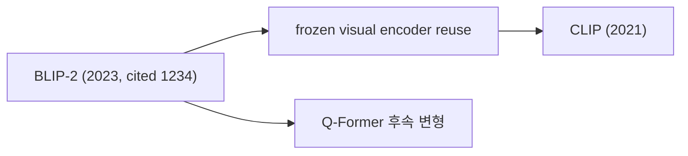

# Research MCP

> 개인용 연구 에이전트 — Claude Desktop에서 arXiv 검색·인용 그래프·논문 위키·시각화를 한 줄 자연어로 실행한다.

논문을 한 번 보면 PDF·figure·요약이 로컬 Obsidian vault에 누적되고, 다음에 같은 주제를 물을 때는 네트워크 호출 없이 vault에서 바로 인용된다. **"한 번 본 논문은 영원히 누적되고, 한 주제의 연구 흐름은 한 장의 그림으로 본다"** 가 목표다.

---

## 주요 기능

### 1. 검색과 인용 그래프
- **arXiv 검색** — 키워드/카테고리로 검색하고 결과를 *최근 1년 / 3년 / 5년 / 그 이상* 으로 자동 분류.
- **인용 그래프** — 특정 논문의 references / citations를 가져와 정렬.
  - `sort="count"` — 절대 인용수 순.
  - `sort="velocity"` — **citation velocity** (`citations / (현재연도 − 발행연도)`) 순. 오래된 논문이 절대 인용수만으로 항상 이기는 문제를 보정해, 최신 흐름에 가까운 결과를 보여준다.
- **인용 문맥 (citation contexts)** — Semantic Scholar의 `contexts` API로 *왜 인용했는지* 본문 스니펫을 수집.
- **유사 논문 추천** — Semantic Scholar Recommendations API 기반, 인용 그래프와는 별개의 신호로 새 토픽 탐색에 적합.

### 2. 멀티모달 논문 위키 (Obsidian vault)
한 번 ingest한 논문은 폴더형 구조로 vault에 저장된다.

```
vault/papers/blip-2/
├── blip-2.md         # frontmatter + TL;DR / Methods / Findings / References (ADR-023: 파일명 = 폴더 slug)
└── figures/
    ├── fig_1.png     # PDF에서 자동 추출된 raster figure
    ├── fig_2.png
    └── ...
```

- **PDF 원본 보관** — `vault/pdfs/<arxiv_id>.pdf` 에 영구 저장. 동일 ID 재요청 시 다운로드 skip.
- **figure 추출** — PyMuPDF로 PDF 내 모든 raster figure를 추출하고 caption과 매칭. 노트 본문에서 `![[figures/fig_1.png]]` 로 임베드되어, 다음 세션에서 Claude가 시각 정보를 다시 참조할 수 있다.
- **동적 토픽 분류** — references / cited_by를 고정 카테고리(model/data/method 등)가 아닌 **자유 문자열 토픽 태그**로 분류한다 (예: `"frozen visual encoder reuse"`, `"Q-Former 후속 변형"`). 인용 문맥 + 인용된 논문 초록을 결합해 LLM이 생성.
- **양방향 wikilink + MOC** — `[[2106.04560-CLIP]]` 같은 wikilink가 자동으로 누적되어, `topics/<slug>.md` MOC(Map of Content) 노트에 백링크로 자연 집계된다.

### 3. 시각화: Mermaid + Obsidian Canvas
한 anchor 논문을 중심으로 인용 흐름을 *카드 그래프* 로 출력한다. 두 형식이 동시에 산출된다.

- **Mermaid graph** — 응답에 즉시 임베드되어 Claude Desktop / GitHub / Obsidian이 그대로 렌더.
- **Obsidian Canvas JSON** (`vault/canvases/<slug>.canvas`) — 사용자가 옵시디언에서 카드를 자유 배치 가능한 1.0 spec.



### 4. 일일 인기 논문 피드
- **Hugging Face Daily Papers** — 하루 단위 인기 논문을 받아 upvote 순으로 정렬. `daily-digest` 스킬로 `digests/<YYYY-MM-DD>.md` 노트에 자동 누적.

---

## MCP Tool 카탈로그

| 카테고리 | Tool |
|---|---|
| **fetch** | `search_papers`, `get_paper_by_id`, `get_hf_daily_papers`, `get_citation_contexts` |
| **graph** | `get_references_by_citations`, `get_citations_by_citations` |
| **artifact** | `download_paper`, `read_paper`, `extract_paper_figures`, `extract_paper_tables`, `prune_paper_figures`, `prune_paper_tables`, `render_paper_page` |
| **wiki** | `wiki_read_note`, `wiki_write_note`, `wiki_list`, `wiki_list_hubs`, `wiki_link` |
| **viz** | `build_citation_canvas` |

각 tool은 한 카테고리에만 속하도록 직교적으로 설계되어 있다 — 호출 순서를 가진 워크플로우는 아래 *스킬* 로 묶인다.

---

## 스킬 (워크플로우)

Claude Desktop에서 자연어 한 줄로 호출 가능한 사전 정의 워크플로우들.

| 스킬 | 트리거 예시 | 하는 일 |
|---|---|---|
| `paper-ingest` | "이 논문 ingest", "BLIP-2 위키에 추가" | 메타·PDF·figure·요약을 한 번에 vault에 누적 |
| `citation-analysis` | "BLIP-2 흐름 보여줘", "<arxiv_id> 인용 분석" | anchor 1편 중심으로 refs/cites 동적 토픽 + cited_for 채우기 + 시각화. vault 영구 누적은 사용자 승인 게이트. |
| `daily-digest` | "오늘 트렌딩 논문", "daily digest" | HF Daily를 받아 `digests/<date>.md` 에 정리, 오늘의 흐름 3-5줄 요약 작성 |

---

## 설치

### 요구사항
- Python `>=3.10`
- [uv](https://github.com/astral-sh/uv) (의존성 관리)
- Obsidian (vault를 보기 위해, 필수는 아님)

### 의존성 설치
```bash
uv sync
```

### Claude Desktop MCP 설정
`~/Library/Application Support/Claude/claude_desktop_config.json` 에 추가:

```json
{
  "mcpServers": {
    "research": {
      "command": "uv",
      "args": ["--directory", "/path/to/research-mcp", "run", "python", "server.py"],
      "env": {
        "OBSIDIAN_VAULT_PATH": "/Users/you/Documents/research-wiki",
        "SS_API_KEY": "<optional Semantic Scholar API key>"
      }
    }
  }
}
```

### 환경 변수
| 변수 | 기본값 | 설명 |
|---|---|---|
| `OBSIDIAN_VAULT_PATH` | `~/Documents/research-wiki` | 노트·PDF·figure가 저장될 vault 루트 |
| `PDF_PATH` | `$OBSIDIAN_VAULT_PATH/pdfs` | PDF 원본 저장 위치 |
| `CACHE_DIR` | `./.cache` | 외부 API 응답 디스크 캐시 |
| `SS_API_KEY` | (없음) | Semantic Scholar API key. 설정 시 429 rate-limit 완화 |

---

## 데이터 소스

- **arXiv** — 검색 + 원본 PDF 다운로드
- **Semantic Scholar** — citation graph, citation contexts, 추천
- **Hugging Face Daily Papers** — 일일 인기 논문 (비공식 JSON API → HTML fallback)

모든 외부 응답은 디스크 캐시를 거치므로 동일 paper_id 재요청은 0 네트워크 비용.

---

## Vault 레이아웃

```
vault/
├── papers/
│   └── <title-slug>/
│       ├── <title-slug>.md  # frontmatter + 본문 (TL;DR / Methods / Findings / References)
│       └── figures/
│           └── fig_<n>.png
├── topics/
│   └── <slug>.md            # MOC — 백링크로 자동 집계되는 토픽 인덱스
├── digests/
│   └── <YYYY-MM-DD>.md      # 일일 HF Daily 노트
├── canvases/
│   └── <slug>.canvas        # Obsidian Canvas JSON
└── pdfs/
    └── <arxiv_id>.pdf
```

`papers/<title-slug>/<title-slug>.md` frontmatter 예:

```yaml
arxiv_id: 2301.12597
title: "BLIP-2: Bootstrapping Language-Image Pre-training with Frozen Image Encoders"
year: 2023
citation_count: 1234
citation_velocity: 411.3
topics: [vlm, vision-language, frozen-encoder]
references:
  - paper_id: 2106.04560
    topic: "frozen visual encoder reuse"
    cited_for: "BLIP-2의 frozen ViT 초기화 근거로 인용"
figures:
  - file: figures/fig_1.png
    caption: "Figure 1: BLIP-2 architecture overview."
```

---

## 사용 예시

Claude Desktop에서:

```
> BLIP-2 위키에 추가해줘
→ paper-ingest 스킬 발동 → papers/blip-2/ 폴더 생성, figure·table 추출

> BLIP-2 흐름 보여줘
→ citation-analysis 스킬 발동 → refs/cites 동적 토픽 + cited_for 채움
  → 사용자 승인 게이트 → vault 영구 누적 + Mermaid·Canvas 시각화

> 오늘 트렌딩 논문 정리해줘
→ daily-digest 스킬 발동 → digests/2026-06-07.md 저장
```

---

## 라이선스

개인용 프로젝트.
