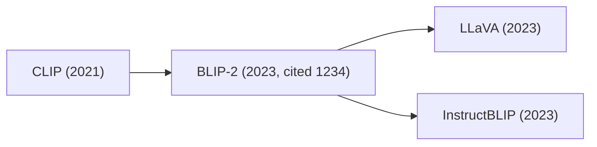

# Research MCP

> 개인용 연구 에이전트 — arXiv 검색·인용 그래프·멀티모달 논문 위키·시각화를 자연어 한 줄로 실행.
> **Claude Desktop (MCP)** 과 **self-hosted 웹 채팅 앱** 두 가지 인터페이스 사용.

---

## 주요 기능

### 1. 검색과 인용 그래프
- **arXiv 검색** — 키워드/카테고리로 검색하고 결과를 *최근 1년 / 3년 / 5년 / 그 이상* 으로 자동 분류.
- **인용 그래프** — 특정 논문의 references / citations를 가져와 정렬.
  - `sort="count"` — 절대 인용수 순.
  - `sort="velocity"` — **citation velocity** (`citations / (현재연도 − 발행연도)`) 순. 오래된 논문이 절대 인용수만으로 항상 이기는 문제를 보정해 최신 흐름에 가까운 결과를 보여준다.
- **인용 문맥 (citation contexts)** — Semantic Scholar의 `contexts` API로 *왜 인용했는지* 본문 스니펫을 수집.

### 2. 멀티모달 논문 위키 (Obsidian vault)
한 번 ingest한 논문은 폴더형 구조로 vault에 저장된다.

```
vault/papers/blip-2/
├── blip-2.md         # frontmatter + TL;DR / Methods / Findings / References (파일명 = 폴더 slug)
└── figures/
    ├── fig_1_overview-of-blip-2s-framework.png
    ├── fig_2_q-former-architecture.png
    └── ...
```

- **PDF 원본 보관** — `vault/pdfs/<arxiv_id>.pdf` 에 영구 저장. 동일 ID 재요청 시 다운로드 skip.
- **Vision 기반 figure / table 추출** — Gemini Vision으로 figure·table 영역을 crop한다. *(`GOOGLE_API_KEY` 필요)*
- **안정 hub 분류** — 큐레이트된 **hub 노트**(e.g. `topics/*.md` — `LLM`, `VLM`, `Diffusion`, `Agent-Reasoning`)에 1–3개로 매핑.
- **양방향 wikilink** — `[[clip]]` 같은 wikilink가 자동 누적.
- **vault 리트리벌** — `wiki_search`로 "질문 → 관련 노트"를 어휘 seed + `[[wikilink]]` 이웃 확장으로 검색. vault 전체를 로드하지 않고 관련 노트만 추린다.
- **종합 통찰 노트** — 세션에서 논문을 가로질러 얻은 통찰을 `insight-capture` 스킬로 `notes/<slug>.md`에 누적 (승인 게이트).

### 3. 시각화: Mermaid + Obsidian
한 anchor 논문을 중심으로 인용 흐름을 *카드 그래프* 로 출력.

- **Mermaid graph** — 응답에 즉시 임베드되어 Claude Desktop / GitHub / Obsidian이 그대로 렌더.
- **Mermaid 노트 저장** — 같은 다이어그램을 `vault/graphs/<slug>.md` 노트로도 저장. Obsidian이 노트를 열면 그래프로 렌더 (auto-layout이라 노드 겹침 없음).



### 4. 일일 인기 논문 피드
- **Hugging Face Daily Papers** — 하루 단위 인기 논문을 upvote 순으로 정렬. `daily-digest` 스킬로 `digests/<YYYY-MM-DD>.md` 노트에 자동 누적.

---

## 아키텍처

```
sources/  →  analysis/  →  wiki/  →  tools/  ─┬─  server.py            (Claude Desktop · MCP)
 (fetch)     (rank/group)  (vault)  (20 tool)  │
                                               └─  agent/ → api/ → web/  (웹 앱 · SSE 채팅)
```

- **단방향 import** — 위 화살표 방향으로만 의존. 역방향 금지.
- **tool은 한 곳에 정의** — `tools/*.py`의 함수를 MCP(`server.py`)와 에이전트(`agent/`)가 동일하게 재사용한다. 같은 20개 도구가 두 transport로 노출된다.
- **에이전트** — Pydantic-AI. provider-prefixed 모델 문자열(`anthropic:` / `openai:` / `google:`)로 멀티 provider 전환. 스킬 정의를 system prompt로 로드.

---

## MCP Tool 카탈로그 (20)

각 tool은 한 카테고리에만 속하도록 직교적으로 설계 — 호출 순서를 가진 워크플로우는 아래 *스킬* 로 묶인다.

| 카테고리 | Tool |
|---|---|
| **fetch** | `search_papers`, `get_paper_by_id`, `get_hf_daily_papers`, `get_citation_contexts` |
| **graph** | `get_references_by_citations`, `get_citations_by_citations` |
| **artifact** | `download_paper`, `read_paper`, `extract_paper_figures`, `extract_paper_tables`, `prune_paper_figures`, `prune_paper_tables`, `render_paper_page` |
| **wiki** | `wiki_read_note`, `wiki_write_note`, `wiki_list`, `wiki_list_hubs`, `wiki_search`, `wiki_link` |
| **viz** | `build_citation_graph` |

---

## 스킬 (워크플로우)

자연어 한 줄로 호출 가능한 사전 정의 워크플로우 (도구 호출 시퀀스).

| 스킬 | 트리거 예시 | 하는 일 |
|---|---|---|
| `paper-ingest` | "이 논문 ingest", "BLIP-2 위키에 추가" | 메타·PDF·figure·table·요약을 한 번에 vault에 누적. 분야를 기존 hub에 매핑. |
| `citation-analysis` | "BLIP-2 흐름 보여줘", "<arxiv_id> 인용 분석" | anchor 1편 중심으로 refs/cites를 hub로 분류 + `cited_for` 채우기 + 시각화. vault 영구 누적은 사용자 승인 게이트. |
| `daily-digest` | "오늘 트렌딩 논문", "daily digest" | HF Daily를 받아 `digests/<date>.md` 에 정리, 오늘의 흐름 요약. |
| `wiki-lint` | "위키 점검", "vault 정리" | vault 정합성 점검 — orphan·깨진 링크·누락 교차참조·stale hub·노트 간 모순 스캔 → 승인 게이트 diff. |
| `insight-capture` | "이 통찰 저장", "notes에 정리" | 논문을 가로질러 종합한 통찰을 `notes/<slug>.md`에 누적 (승인 게이트). |
| `self-improve` | "회고 반영해줘", "self-improve" | 세션 회고·반복 실패를 분석해 `CLAUDE.md`/`docs/*` diff 제안 (승인 게이트, 메타 레이어). |

---

## 설치

### 요구사항
- Python `>=3.10`
- [uv](https://github.com/astral-sh/uv) (의존성 관리)
- Obsidian (vault·그래프를 보기 위해 — 권장)

```bash
uv sync
```

### 플러그인 설치 (권장 — Claude Desktop / Claude Code)

```
/plugin marketplace add cholhwanjung/research-mcp
/plugin install research-mcp@research-mcp
```

활성화(enable) 시 아래를 프롬프트로 입력한다. **secret은 repo가 아니라 keychain에 저장된다.**

| 설정 | 설명 |
|---|---|
| `vault_path` | vault 루트 (예: `/Users/you/Documents/research-wiki`). 비우면 `~/Documents/research-wiki` |
| `google_api_key` | Gemini Vision — figure/table 추출용. 없으면 멀티모달 skip, 텍스트 요약만 |
| `ss_api_key` | Semantic Scholar API key (선택) — rate-limit 완화 |

> **요구사항**: `uv`가 설치돼 있어야 한다 (플러그인이 `server.py`를 uv로 기동). 첫 기동 시 의존성 sync가 한 번 돈다(네트워크 필요, 수십 초). 업데이트는 `/plugin marketplace update` 후 재설치.

### Claude Desktop MCP 설정 (수동 — 대안)

> 플러그인 대신 **MCP 서버만** 직접 등록하는 방법. 이 경로는 **스킬을 포함하지 않는다** (플러그인은 6개 스킬까지 번들). tool만 필요할 때 사용.

`~/Library/Application Support/Claude/claude_desktop_config.json` 에 추가:

```json
{
  "mcpServers": {
    "research": {
      "command": "uv",
      "args": ["--directory", "/path/to/research-mcp", "run", "python", "server.py"],
      "env": {
        "OBSIDIAN_VAULT_PATH": "/Users/you/Documents/research-wiki",
        "GOOGLE_API_KEY": "<Gemini Vision — figure/table 추출용>",
        "SS_API_KEY": "<optional Semantic Scholar API key>"
      }
    }
  }
}
```

| 변수 | 기본값 | 설명 |
|---|---|---|
| `OBSIDIAN_VAULT_PATH` | `~/Documents/research-wiki` | 노트·PDF·figure 저장 vault 루트 |
| `PDF_PATH` | `$OBSIDIAN_VAULT_PATH/pdfs` | PDF 원본 저장 위치 |
| `GOOGLE_API_KEY` | (없음) | Gemini Vision — figure/table bbox 추정에 필요 |
| `SS_API_KEY` | (없음) | Semantic Scholar API key. 설정 시 rate-limit 완화 |

---

## 웹 앱 (self-hosted) — 멀티 LLM 채팅

Claude Desktop 외에, 같은 도구·워크플로우를 **웹 채팅 UI**로도 쓸 수 있음.

### 구성
- `api/` — FastAPI + SSE 백엔드. `/chat`(스트리밍) · `/skills` · `/health`. Bearer 토큰 인증(옵션).
- `agent/` — Pydantic-AI 에이전트. MCP의 tool 재사용 + multi-provider.
- `web/` — Next.js 채팅 프론트 (스트리밍 + 모델 선택기 + 토큰 입력).

### 실행 — 한 번에 (로컬, 추천)
```bash
cp .env.example .env       # 쓸 provider 키만 채우기 (예: GOOGLE_API_KEY)
./run-web.sh               # .env 의 RESEARCH_MODEL (미설정 시 Claude)
./run-web.sh google        # Gemini  — GOOGLE_API_KEY 만 있으면 됨 (Anthropic 키 불필요)
./run-web.sh openai        # GPT-4o  — OPENAI_API_KEY
./run-web.sh anthropic     # Claude  — ANTHROPIC_API_KEY
```
→ 백엔드(:8000)+프론트(:3000) 동시 기동. 접속: **http://localhost:3000**
- 인자로 고른 모델이 백엔드 기본값(`RESEARCH_MODEL`)으로 적용 (웹 UI에서 메시지별 전환도 가능). `provider:model` 직접 지정도 됨 (예: `./run-web.sh google:gemini-2.0-flash`).
- 선택한 provider 키가 없으면 **부팅 전에 안내하고 멈춤** (lifespan 에러 회피).
- Ctrl-C 한 번으로 둘 다 종료. 최초 1회 `uv sync`·`npm install` 자동, Docker 불필요.
- `.env`는 백엔드(`core/config.py`)가 자동 로드, 프론트 기본 API_URL은 `http://localhost:8000`.

**사용**: 우상단 토큰칸에 `RESEARCH_API_TOKEN` 값 입력(설정 시) → 채팅. 예: `"BLIP-2 위키에 추가해줘"` → 채팅에 tool 실행 흐름 표시 → **Obsidian을 열어** 노트·그래프 확인.

### 실행 — Docker (self-hosted 배포)
```bash
cp .env.example .env        # provider 키 + VAULT_HOST_PATH 채우기
docker compose up --build   # 백엔드 → http://localhost:8000
```
- `VAULT_HOST_PATH`는 **Docker 파일공유 대상 경로**여야 한다 (홈 하위 `~/Documents/...`는 기본 공유됨; `/tmp` 등은 공유 안 될 수 있어 컨테이너가 안 뜬다).
- 세션 SQLite는 named volume(`sessions`)에 저장 — vault 바인드마운트와 분리해 안정성 확보.
- 프론트는 컨테이너에 없음 → 아래 "수동 실행"의 프론트 명령으로 별도 기동.

### 수동 실행 (개별 기동, 선택)
`run-web.sh` 대신 백엔드·프론트를 따로 띄울 때:
```bash
uv run uvicorn api.main:create_app --factory --port 8000   # 백엔드
cd web && npm run dev                                       # 프론트(:3000)
```
백엔드를 비표준 호스트/포트로 띄우면 `web/.env.local`에 `NEXT_PUBLIC_API_URL=…` 지정.

### 환경 변수 (웹 앱)
| 변수 | 설명 |
|---|---|
| `RESEARCH_API_TOKEN` | 설정 시 API 호출에 `Authorization: Bearer` 강제 (비우면 인증 off) |
| `RESEARCH_MODEL` | 기본 채팅 모델 (`anthropic:…` / `openai:…` / `google:…`) |
| `ANTHROPIC_API_KEY` / `OPENAI_API_KEY` / `GEMINI_API_KEY` | 사용할 provider 키 |
| `GOOGLE_API_KEY` | Gemini Vision — figure/table 추출 (ingest 시) |
| `VAULT_HOST_PATH` | (compose) host vault 절대경로 → 컨테이너 `/vault` |

---

## Vault 레이아웃

```
vault/
├── papers/
│   └── <title-slug>/
│       ├── <title-slug>.md  # frontmatter + 본문 (TL;DR / Methods / Findings / References)
│       └── figures/
│           └── fig_<n>_<caption-slug>.png
├── topics/
│   └── <hub-slug>.md        # 안정 hub — 백링크로 논문이 자동 집계
├── notes/
│   └── <slug>.md            # 논문 간 종합 통찰 (insight-capture)
├── digests/
│   └── <YYYY-MM-DD>.md      # 일일 HF Daily 노트
├── graphs/
│   └── <slug>.md            # 인용 흐름 Mermaid 노트 (build_citation_graph)
└── pdfs/
    └── <arxiv_id>.pdf
```

`papers/<title-slug>/<title-slug>.md` frontmatter 예:

```yaml
arxiv_id: 2301.12597
title: "BLIP-2: Bootstrapping Language-Image Pre-training with Frozen Image Encoders"
year: 2023
citation_count: 1234
citation_velocity: 411.3
topics: [vlm, multimodal]
references:
  - paper_id: 2103.00020
    topic: clip-contrastive
    cited_for: "BLIP-2의 frozen 이미지 인코더 초기화 근거로 인용"
figures:
  - file: figures/fig_1_overview.png
    caption: "Figure 1: BLIP-2 architecture overview."
```

---

## 기술 스택

| 영역 | 선택 |
|---|---|
| MCP 서버 | FastMCP (stdio) |
| 에이전트 | Pydantic-AI — multi-provider (Anthropic / OpenAI / Google) |
| 백엔드 | FastAPI + SSE (스트리밍) |
| 프론트 | Next.js 16 · React 19 · Tailwind CSS v4 |
| 추출 | PyMuPDF (PDF) + Gemini Vision (figure/table bbox) |
| 저장 | Obsidian vault (Markdown), SQLite (대화 세션) |
| 데이터 | arXiv · Semantic Scholar · Hugging Face Daily Papers |
| 캐시 | 디스크 캐시 — 동일 paper_id 재요청은 0 네트워크 |

---

## 사용 예시

```
> BLIP-2 위키에 추가해줘
→ paper-ingest → papers/blip-2/ 생성, figure·table 추출·선별, 요약 + hub 매핑

> BLIP-2 흐름 보여줘
→ citation-analysis → refs/cites를 hub로 분류 + cited_for 채움
  → 사용자 승인 게이트 → vault 누적 + Mermaid 시각화(`graphs/` 노트) → Obsidian 그래프로 확인

> 오늘 트렌딩 논문 정리해줘
→ daily-digest → digests/2026-06-29.md 저장
```

---

## 라이선스

개인용 프로젝트.
