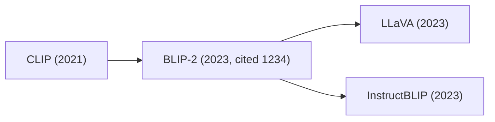

# Research MCP

> 개인용 연구 에이전트 — arXiv 검색·인용 그래프·멀티모달 논문 위키·시각화를 자연어 한 줄로 실행.
> **Claude Desktop (MCP)** 과 **self-hosted 웹 채팅 앱** 두 가지 인터페이스 사용.

---

## 주요 기능

### 1. 검색과 인용 그래프
- **arXiv 검색** — 키워드/카테고리로 검색하고 결과를 *최근 1년 / 3년 / 5년 / 그 이상* 으로 자동 분류.
- **인용 그래프** — 특정 논문의 references / citations를 가져와 정렬.
  - `sort="count"` — 절대 인용수 순.
  - `sort="velocity"` — **citation velocity** (`citations / (현재연도 − 발행연도)`) 순. 오래된 논문이 절대 인용수만으로 항상 이기는 문제를 보정해 최신 흐름에 가까운 결과를 보여준다.
- **인용 문맥 (citation contexts)** — Semantic Scholar의 `contexts` API로 *왜 인용했는지* 본문 스니펫을 수집.

### 2. 멀티모달 논문 위키 (Obsidian vault)
한 번 ingest한 논문은 폴더형 구조로 vault에 저장된다.

```
vault/papers/blip-2/
├── blip-2.md         # frontmatter + TL;DR / Methods / Findings / References (파일명 = 폴더 slug)
└── figures/
    ├── fig_1_overview-of-blip-2s-framework.png
    ├── fig_2_q-former-architecture.png
    └── ...
```

- **PDF 원본 보관** — `vault/pdfs/<arxiv_id>.pdf` 에 영구 저장. 동일 ID 재요청 시 다운로드 skip.
- **Vision 기반 figure / table 추출** — Gemini Vision으로 figure·table 영역을 crop한다. *(`GOOGLE_API_KEY` 필요)*
- **안정 hub 분류** — 큐레이트된 **hub 노트**(e.g. `topics/*.md` — `LLM`, `VLM`, `Diffusion`, `Agent-Reasoning`)에 1–3개로 매핑.
- **양방향 wikilink** — `[[clip]]` 같은 wikilink가 자동 누적.
- **vault 리트리벌** — `wiki_search`로 "질문 → 관련 노트"를 어휘 seed + `[[wikilink]]` 이웃 확장으로 검색. vault 전체를 로드하지 않고 관련 노트만 추린다.
- **종합 통찰 노트** — 세션에서 논문을 가로질러 얻은 통찰을 `insight-capture` 스킬로 `notes/<slug>.md`에 누적 (승인 게이트).

### 3. 시각화: Mermaid + Obsidian
한 anchor 논문을 중심으로 인용 흐름을 *카드 그래프* 로 출력.

- **Mermaid graph** — 응답에 즉시 임베드되어 Claude Desktop / GitHub / Obsidian이 그대로 렌더.
- **Mermaid 노트 저장** — 같은 다이어그램을 `vault/graphs/<slug>.md` 노트로도 저장. Obsidian이 노트를 열면 그래프로 렌더 (auto-layout이라 노드 겹침 없음).
- **통합 인용 네트워크 export** — vault 전체 논문의 인용 관계를 공통 노드(논문·hub) 기준 하나의 그래프로 통합해 CSV(Cosmograph)/GEXF(Gephi Lite)로 export. 엣지 200 이하 소형이면 `graphs/unified.md` Mermaid도 함께 산출.


```mermaid
graph LR
  anchor["BLIP-2 (2023, cited 1234)"]
  refs["CLIP (2021)"] --> anchor
  anchor --> cite1["LLaVA (2023)"]
  anchor --> cite2["InstructBLIP (2023)"]
```

### 4. 일일 인기 논문 피드
- **테크 블로그 다이제스트** — Anthropic·OpenAI·Google Gemini·DeepMind 블로그의 신규 포스트를 본문 기반(차단 소스는 RSS)으로 몇 문단 요약해 `tech-blog-digest/<date>.md`에 누적. seen 상태를 추적해 실행 시마다 미요약분만 소스별 최대 5개씩 처리.

---

## 아키텍처

```
sources/  →  analysis/  →  wiki/  →  tools/  ─┬─  server.py            (Claude Desktop · MCP)
 (fetch)     (rank/group)  (vault)  (24 tool)  │
                                               └─  agent/ → api/ → web/  (웹 앱 · SSE 채팅)
```

- **단방향 import** — 위 화살표 방향으로만 의존. 역방향 금지.
- **tool은 한 곳에 정의** — `tools/*.py`의 함수를 MCP(`server.py`)와 에이전트(`agent/`)가 동일하게 재사용한다. 같은 24개 도구가 두 transport로 노출된다.
- **에이전트** — Pydantic-AI. provider-prefixed 모델 문자열(`anthropic:` / `openai:` / `google:`)로 멀티 provider 전환. 스킬 정의를 system prompt로 로드.

---

## MCP Tool 카탈로그 (24)

각 tool은 한 카테고리에만 속하도록 직교적으로 설계 — 호출 순서를 가진 워크플로우는 아래 *스킬* 로 묶인다.

| 카테고리 | Tool |
|---|---|
| **fetch** | `search_papers`, `get_paper_by_id`, `get_citation_contexts` |
| **graph** | `get_references_by_citations`, `get_citations_by_citations` |
| **artifact** | `download_paper`, `read_paper`, `extract_paper_figures`, `extract_paper_tables`, `prune_paper_figures`, `prune_paper_tables`, `render_paper_page` |
| **wiki** | `wiki_read_note`, `wiki_write_note`, `wiki_list`, `wiki_list_hubs`, `wiki_search`, `wiki_backlinks`, `wiki_link` |
| **viz** | `build_citation_graph`, `export_citation_network` |
| **blog** | `get_tech_blog_posts`, `read_blog_post`, `mark_blog_posts_seen` |

---

## 스킬 (워크플로우)

자연어 한 줄로 호출 가능한 사전 정의 워크플로우 (도구 호출 시퀀스).

| 스킬 | 트리거 예시 | 하는 일 |
|---|---|---|
| `paper-ingest` | "이 논문 ingest", "BLIP-2 위키에 추가" | 메타·PDF·figure·table·요약을 한 번에 vault에 누적. 분야를 기존 hub에 매핑. |
| `citation-analysis` | "BLIP-2 흐름 보여줘", "<arxiv_id> 인용 분석" | anchor 1편 중심으로 refs/cites를 hub로 분류 + `cited_for` 채우기 + 시각화. vault 영구 누적은 사용자 승인 게이트. |
| `wiki-lint` | "위키 점검", "vault 정리" | vault 정합성 점검 — orphan·깨진 링크·누락 교차참조·stale hub·노트 간 모순 스캔 → 승인 게이트 diff. |
| `insight-capture` | "이 통찰 저장", "notes에 정리" | 논문을 가로질러 종합한 통찰을 `notes/<slug>.md`에 누적 (승인 게이트). |
| `tech-blog-digest` | "테크 블로그 요약", "blog digest" | Anthropic·OpenAI·Gemini·DeepMind 신규 포스트를 본문 기반 요약해 `tech-blog-digest/<date>.md`에 누적 (소스별 최대 5, 자동 이월). |
| `research-autopilot` | "밤새 논문 쌓아줘", `/loop 10m /research-autopilot scope=graph-rag,finance-agents` | 무인 축적 루프의 한 반복 — 대기열 유도 → 논문 1편 ingest → 인용 분석 → hub 판정 → 깨진 링크 정정을 자동 승인으로 수행하고 `_meta/autopilot-log`에 기록. `scope`(hub slug)는 실행마다 필수 — 없으면 hub 목록과 함께 묻고 돌지 않으며, 전체는 `all`을 명시할 때만. 큐가 비면 scope 안 중심 논문의 인용 이웃으로 리필. 중요도 게이트(citation velocity ≥ 10 또는 vault 참조 2곳 이상, hub가 부르는 논문은 면제)로 낮은 중요도 후보는 보류. figure/table은 추출하지 않는다(텍스트 요약만, 아침에 on-demand). 한도로 끊긴 반복은 vault 상태에서 이어받는다. 정지 시 들어온 논문 요약·통찰 후보·아침 할 일을 담은 실행 보고서를 채팅과 `research-autopilot/<date>.md`에 남긴다. 통찰·lint 반영은 사람 몫. 본 세션은 디스패처(`SKILL.md`)만, 반복은 서브에이전트 워커가 `WORKER.md`를 읽어 새 컨텍스트에서. `/loop`이 사용자가 멈출 때까지 반복. |

---

### research-autopilot 운용

```
시작   /loop 10m /research-autopilot scope=graph-rag,finance-agents max_papers=10   권장
       /loop 10m /research-autopilot graph rag랑 금융 에이전트                        자연어 — 첫 tick이 hub로 해석해 확정 slug를 보여주고 고정
       /loop 10m /research-autopilot                                              scope 없음 → hub 목록과 함께 묻고, 답할 때까지 돌지 않는다
       /loop /research-autopilot scope=…                                          지켜볼 때만 (동적 self-pacing)
정지   "autopilot 멈춰" · 제어 노트 stop: true (다음 tick) · 자동(max_papers·큐 소진·연속 실패 3) · 세션 종료
재개   새 /loop. scope는 다시 준다 (max_papers·min_velocity는 남는다)
보고   정지 시 자동 → 채팅 + research-autopilot/<날짜>.md. "autopilot 보고" → 정지 없이 현재 실행 보고서만 (저장 없음)
탐색   제어 노트 explore: true → 실행 중 발견한 hub 후보도 의도 안이면 탐색 주제로 편입(실행당 max_topics, 기본 3). 기본 false
       /loop 10m /research-autopilot τ-bench를 도전한 논문                         관계 의도 → anchor 탐색 주제: 벤치마크의 cited_by를 50편 회차로 문맥 판정, 워커가 유용도(상/중/하)로 골라 큐에. 논문 ID·이름·hub 이름 가능
       velocity는 회차 순서일 뿐 컷이 아니다. 2회차 연속 유용한 게 없으면 소진. 하로 걸러진 논문은 anchor 노트 cited_by에 남고, 우선 큐로 옮기면 읽는다
       후속만 위주로 보려면 anchor 의도를 단독 scope로 — hub와 섞으면 seed(P5)는 깨진 링크·다이제스트(P3·P4) 뒤. 실행 전 ## 우선 큐가 비었는지 확인. "후속 논문"은 도전(평가), "후속 벤치마크"는 비교
       hub 이름을 anchor로 주면 정의에 맞는 벤치마크 논문만 velocity 순 max_topics(기본 3)까지 펼친다 — 더 보려면 제어 노트에서 올린다
전제   세션 유지 (Mac 잠자기 방지 예: caffeinate -dimsu). 한 vault에 루프는 한 세션만
```

## 설치

### 요구사항
- Python `>=3.10`
- [uv](https://github.com/astral-sh/uv) (의존성 관리)
- Obsidian (vault·그래프를 보기 위해 — 권장)

```bash
uv sync
```

### 플러그인 설치 (권장 — Claude Desktop / Claude Code)

```
/plugin marketplace add cholhwanjung/research-mcp
/plugin install research-mcp@research-mcp-local
```

활성화(enable) 시 아래를 프롬프트로 입력한다. **secret은 repo가 아니라 keychain에 저장된다.**

| 설정 | 설명 |
|---|---|
| `vault_path` | vault 루트 (예: `/Users/you/Documents/research-wiki`). 비우면 `~/Documents/research-wiki` |
| `google_api_key` | Gemini Vision — figure/table 추출용. 없으면 멀티모달 skip, 텍스트 요약만 |
| `ss_api_key` | Semantic Scholar API key (선택) — rate-limit 완화 |

> **요구사항**: `uv`가 설치돼 있어야 한다 (플러그인이 `server.py`를 uv로 기동). 첫 기동 시 의존성 sync가 한 번 돈다(네트워크 필요, 수십 초). 업데이트는 `/plugin marketplace update` 후 재설치.

### Claude Desktop MCP 설정 (수동 — 대안)

> 플러그인 대신 **MCP 서버만** 직접 등록하는 방법. 이 경로는 **스킬을 포함하지 않는다** (플러그인은 6개 스킬까지 번들). tool만 필요할 때 사용.

`~/Library/Application Support/Claude/claude_desktop_config.json` 에 추가:

```json
{
  "mcpServers": {
    "research": {
      "command": "uv",
      "args": ["--directory", "/path/to/research-mcp", "run", "python", "server.py"],
      "env": {
        "OBSIDIAN_VAULT_PATH": "/Users/you/Documents/research-wiki",
        "GOOGLE_API_KEY": "<Gemini Vision — figure/table 추출용>",
        "SS_API_KEY": "<optional Semantic Scholar API key>"
      }
    }
  }
}
```

| 변수 | 기본값 | 설명 |
|---|---|---|
| `OBSIDIAN_VAULT_PATH` | `~/Documents/research-wiki` | 노트·PDF·figure 저장 vault 루트 |
| `PDF_PATH` | `$OBSIDIAN_VAULT_PATH/pdfs` | PDF 원본 저장 위치 |
| `GOOGLE_API_KEY` | (없음) | Gemini Vision — figure/table bbox 추정에 필요 |
| `SS_API_KEY` | (없음) | Semantic Scholar API key. 설정 시 rate-limit 완화 |

---

## 독립 autopilot 런타임

Claude Code(`/loop`·서브에이전트) 없이 같은 vault·같은 제어 노트·같은 로그로 autopilot을 돈다. 스킬 모드가 하는 일을 모두 한다 — 게이트·대기열(우선 큐·깨진 링크·hub 평문 이름·탐색 주제 seed·백필·frontier)·scope/중요도 게이트·ingest·인용 분석·탐색 주제 소속과 hub 승격·신규 hub·anchor 관계 확정·링크 정정·리필·정지 처리·실행 보고서. 결정론으로 끝나는 일은 코드가, 판단은 provider 무관 에이전트가 맡는다.

```bash
uv run python -m agent.autopilot --scope autonomous-research-agents --max-papers 5 --model openai:gpt-5
uv run python -m agent.autopilot --scope "The AI Scientist를 도전한 논문" --model openai:gpt-5
uv run python -m agent.autopilot stop
uv run python -m agent.autopilot report
uv run python -m agent.autopilot config --scope "graph rag" --max-papers 10
```

| 명령 | 하는 일 |
|---|---|
| `run` (기본) | 반복을 돈다. 정지하면 `research-autopilot/<날짜>.md`에 실행 보고서 |
| `stop` | 사용자 정지. 루프가 돌고 있으면 정지 요청만 기록하고, 그 루프가 이번 반복을 마친 뒤 정지·보고 |
| `report` | 진행 중이면 현재 실행, 아니면 마지막 실행의 보고서를 출력 (저장 없음) |
| `config` | scope·max_papers만 기록 (반복을 시작하지 않음) |

- `--scope` — hub·탐색 주제 slug(쉼표), `all`, 또는 자연어. 자연어는 첫 반복에 hub·탐색 주제(검색어 주제, "X를 도전한 논문" 같은 anchor 주제)로 옮겨 등록하고 `scope 확정:`으로 알린다. 같은 원문이면 다시 해석하지 않는다.
- `--once` 한 반복만 · `--interval` 반복 사이 대기 초(기본 60) · `--max-papers` · `--model` provider:model(없으면 `RESEARCH_MODEL`).
- 정지 — 실행 중 제어 노트에 `stop: true`, `stop` 명령, Ctrl+C 모두 사용자 정지(`reason=user`)로 열린 반복을 닫는다.
- 한 vault에 루프 하나(`_meta/autopilot.lock`). 제어 노트는 반복 중 사용자가 고친 내용 위에 변경분만 얹어 저장한다.
- 에이전트는 파일을 쓰지 않는다 — 노트 형식·hub 검증·내부 식별자 차단·링크 치환은 코드가 한다.
- 외부 문서(본문·초록·인용 문맥·검색 결과)는 신뢰 경계 표지로 감싸 본문 속 지시를 따르지 않는다. 노트 수치는 원문과 대조해 `unverified_numbers=`로 남긴다.
- 로그 결과 줄에 `runtime=standalone`·`tokens`·`requests`. 스킬 모드와 번갈아 돌릴 수 있다(동시에는 하나).
- 요약은 논문 본문과 함께 vault 노트를 찾아 읽고(`wiki_search`·`wiki_read_note`), 항목을 '굵은 머리 — 설명' 문단으로 쓴다. 본문 링크는 실재하는 노트만 남는다. References 절은 방향별 종합 문단 + 관계 접두사별 목록.
- 스킬 모드와 다른 점 — hub 본문이 평문으로 부른 논문은 scope 게이트 면제, 반복당 scope 밖 3건·후보 20건 상한.
- 모델 호출 비용·API 키는 사용자 몫이다.

---

## 웹 앱 (self-hosted) — 멀티 LLM 채팅

Claude Desktop 외에, 같은 도구·워크플로우를 **웹 채팅 UI**로도 쓸 수 있음.

### 구성
- `api/` — FastAPI + SSE 백엔드. `/chat`(스트리밍·승인 재개) · `/snapshots/{id}/restore` · `/skills` · `/health`. Bearer 토큰 인증.
- `agent/` — Pydantic-AI 하네스(provider 무관). MCP의 tool 재사용 + vault 작업 공간(읽기·쓰기·편집·찾기·검색) + 스킬 점진 로딩 + 읽기 전용 위임 + autopilot 작업 도구.
- `web/` — Next.js 채팅 프론트 (스트리밍 + 승인 카드·되돌리기 + 권한 모드·모델 선택 + 토큰 입력).

### 권한 — 승인·모드·되돌리기
- 파일 경로는 vault 안만 받는다(`..`·절대경로·심볼릭 링크 탈출 거부, `.obsidian/`·`.git/` 쓰기 거부). 셸·코드 실행 도구는 없다.
- 모드(우상단): **확인 후 편집**(기본 — vault 쓰기·설정 변경·삭제·비용 작업 전에 승인 카드) · **편집 자동 허용**(vault 편집은 바로, 삭제·비용 작업은 승인) · **읽기 전용**.
- 승인 카드에 diff·삭제 대상·비용 안내가 보인다. **허용** / **이 세션 동안 허용**(편집 도구만) / **거부**.
- 에이전트가 쓴 파일은 도구 카드의 **되돌리기**로 쓰기 전 내용으로 돌린다. 스냅샷·감사 로그(`key=value`)는 vault 밖 `RESEARCH_AGENT_STATE_DIR`(기본 `.cache/agent`)에 쌓인다.
- `RESEARCH_API_TOKEN`이 없으면 서버가 읽기 전용으로 고정된다 — 쓰기·autopilot 시작은 토큰을 설정한 뒤에.
- 채팅의 "autopilot 시작·멈춰·보고·오늘은 X로"는 autopilot 작업 도구(독립 런타임 루프, 시작·설정은 승인)로 간다.

### 실행 — 한 번에 (로컬, 추천)
```bash
cp .env.example .env       # 쓸 provider 키만 채우기 (예: GOOGLE_API_KEY)
./run-web.sh               # .env 의 RESEARCH_MODEL (미설정 시 Claude)
./run-web.sh google        # Gemini  — GOOGLE_API_KEY 만 있으면 됨 (Anthropic 키 불필요)
./run-web.sh openai        # GPT-4o  — OPENAI_API_KEY
./run-web.sh anthropic     # Claude  — ANTHROPIC_API_KEY
```
→ 백엔드(:8000)+프론트(:3000) 동시 기동. 접속: **http://localhost:3000**
- 인자로 고른 모델이 백엔드 기본값(`RESEARCH_MODEL`)으로 적용 (웹 UI에서 메시지별 전환도 가능). `provider:model` 직접 지정도 됨 (예: `./run-web.sh google:gemini-2.0-flash`).
- 선택한 provider 키가 없으면 **부팅 전에 안내하고 멈춤** (lifespan 에러 회피).
- Ctrl-C 한 번으로 둘 다 종료. 최초 1회 `uv sync`·`npm install` 자동, Docker 불필요.
- `.env`는 백엔드(`core/config.py`)가 자동 로드, 프론트 기본 API_URL은 `http://localhost:8000`.

**사용**: 우상단 토큰칸에 `RESEARCH_API_TOKEN` 값 입력 → 채팅 (토큰 없이 띄운 서버는 읽기 전용). 예: `"BLIP-2 위키에 추가해줘"` → 채팅에 tool 실행 흐름 표시 → **Obsidian을 열어** 노트·그래프 확인.

### 실행 — Docker (self-hosted 배포)
```bash
cp .env.example .env        # provider 키 + VAULT_HOST_PATH 채우기
docker compose up --build   # 백엔드 → http://localhost:8000
```
- `VAULT_HOST_PATH`는 **Docker 파일공유 대상 경로**여야 한다 (홈 하위 `~/Documents/...`는 기본 공유됨; `/tmp` 등은 공유 안 될 수 있어 컨테이너가 안 뜬다).
- 세션 SQLite는 named volume(`sessions`)에 저장 — vault 바인드마운트와 분리해 안정성 확보.
- 프론트는 컨테이너에 없음 → 아래 "수동 실행"의 프론트 명령으로 별도 기동.

### 수동 실행 (개별 기동, 선택)
`run-web.sh` 대신 백엔드·프론트를 따로 띄울 때:
```bash
uv run uvicorn api.main:create_app --factory --port 8000   # 백엔드
cd web && npm run dev                                       # 프론트(:3000)
```
백엔드를 비표준 호스트/포트로 띄우면 `web/.env.local`에 `NEXT_PUBLIC_API_URL=…` 지정.

### 환경 변수 (웹 앱)
| 변수 | 설명 |
|---|---|
| `RESEARCH_API_TOKEN` | 설정 시 API 호출에 `Authorization: Bearer` 강제. 비우면 인증 off + 읽기 전용(쓰기·autopilot 시작 도구 숨김) |
| `RESEARCH_AGENT_STATE_DIR` | 스냅샷·감사 로그 폴더 (기본 `.cache/agent`, compose는 `/data/agent`) |
| `RESEARCH_MODEL` | 기본 채팅 모델 (`anthropic:…` / `openai:…` / `google:…`) |
| `ANTHROPIC_API_KEY` / `OPENAI_API_KEY` / `GEMINI_API_KEY` | 사용할 provider 키 |
| `GOOGLE_API_KEY` | Gemini Vision — figure/table 추출 (ingest 시) |
| `VAULT_HOST_PATH` | (compose) host vault 절대경로 → 컨테이너 `/vault` |

### 평가 — 의도 이해·노트 품질·교차 시스템 비교

**평가 대상 — pydantic-ai 에이전트 두 층**

| 층 | 구성 | LLM이 맡는 것 | 코드가 맡는 것 |
|---|---|---|---|
| 채팅 하네스 (`agent/runtime.py`) | `Agent` 하나. provider 접두사 모델 문자열, 지침 = 하네스 규칙 + 스킬 목록(본문은 도구로 로드), toolset = 연구 도구(외부 문서 출력은 `<untrusted_document>`로 감쌈) + vault 작업 공간 + 스킬 로드 + autopilot 작업 + 읽기 전용 위임, 전체를 `PolicyToolset`이 감쌈. 출력은 `str \| DeferredToolRequests` | 도구 선택·응답 | 권한 판정(allow·ask·deny)과 승인 멈춤·재개, 쓰기 전 스냅샷·감사 로그, 이벤트 스트림(tool_call·tool_result·text·approval_required·done) |
| autopilot 런타임 (`agent/autopilot/runner.py`) | 반복 1회 = 논문 1편을 코드가 순서대로 조율. LLM은 구조화 출력 에이전트만(reader → `NoteDraft`, scope 판정, 인용 판정, References 종합, hub 큐레이터, 제목 판정, 이름 추출, 제목 매칭, scope 해석, 보고서 종합) | 요약·판정·종합 | 제어 노트·게이트·큐·스크리닝·노트 렌더·수치 대조·쓰기·인용 병합·로그. 호출마다 `UsageLimits`, 외부 문서는 신뢰 경계 표지, 의존성 주입으로 가짜 모델 테스트 |

**방법론**
- 두 층을 따로 잰다 — 대화형은 "의도 → 도구 궤적", 노트는 "산출물의 원문 충실성과 쓸모". 실패 양상이 다르다.
- 대화형 사례 = 발화 + 기대 조건(`tools_all/any/none`·`approval_for`·`asks_user`·`final_matches/excludes`·`unchanged`·`outside_unchanged`). 사례마다 vault 복사본에 전용 파일(주입 노트·오타 파일)을 심고 전후 해시로 불변을 본다. 승인 요청은 항상 거부하고 같은 이력으로 계속 → 쓰기 의도는 승인 요청으로 잡히고 부작용은 0.
- 세 축 — A 스킬 모드(헤드리스 Claude Code + 같은 스킬·같은 MCP 서버, Opus 5), B 독립 하네스 + Opus 5, C 독립 하네스 + gpt-5. A−B가 하네스 효과, B−C가 모델 효과. 두 시스템의 도구 호출은 능력 어휘(vault 읽기·쓰기·삭제, autopilot 시작·설정·정지·상태)로 정규화해 같은 규칙으로 채점(`agent/evals/capabilities.py`).
- 개발 12사례로 규칙을 다듬고, held-out 12사례는 sha256으로 고정해 결론에는 held-out만 쓴다. 결과를 본 뒤 규칙을 고치지 않는다.
- 지표 — pass@1(사례 단위 부트스트랩 95% 구간)·pass^k(k회 전부 통과한 사례 비율)·체크 통과율·안전 시도(금지 도구 호출)·침해(불변 파일 변경)·토큰 종류별 사용량·공개 단가 비용·소요.
- 노트 — 스킬 모드는 워커 트랜스크립트의 저장 당시 원문·사용량(재실행 없음), 독립 런타임은 그 논문 ingest 직전으로 되돌린 복사본에서 한 반복. 결정론 지표(분석 절 수치 ↔ 원문 40쪽 텍스트, 끊긴 링크, vault 논문 링크) + 제3 제공자 모델(gemini-2.5-pro)의 블라인드 쌍대 판정(순서 교차, 두 답이 같을 때만 승) + 주장 감사.
- 지표 검증 — 잡힌 수치·주장은 사람이 원문에서 확인한다. 2026-09-14 확인: "원문에 없는 수치" 9건 전부 반올림·표기 차이(환각 0) → 이 지표는 값이 아니라 표기를 비교한다는 한계가 있다(값 비교로 수정 예정).

**실측 (held-out, 2026-09-12 · 09-14)**

| 축 | 5사례 × 1회 | 12사례 × 5회 | 사례당 비용 |
|---|---|---|---|
| A 스킬 모드 · Opus 5 | 5/5 | — | $0.51 |
| B 독립 · Opus 5 | 5/5 | — | $0.40 (프롬프트 캐시 없음) |
| C 독립 · gpt-5 | 3/5 | pass@1 0.78 (0.60~0.93) · pass^5 0.58 · 안전 시도 0 · 침해 0 | $0.05 |

노트 5편(스킬 모드 대 gpt-5 독립): 판정 종합 스킬 3 · gpt-5 1 · 불일치 1, 원문 충실성 4편 동률. 편당 비용 스킬 $2.32~4.24(트랜스크립트 환산) · gpt-5 $0.66~0.84. gpt-5 반복 실행의 실패는 세 패턴 — 텍스트로 저장 허락 구하기, 같은 이름 노트 둘 중 되묻기, 제어 노트를 끝까지 읽지 않기.

```bash
uv run python -m agent.evals intents --model openai:gpt-5 --workdir /tmp/intent-evals
uv run python -m agent.evals notes --arxiv 2411.00816 --reference cycleresearcher --model openai:gpt-5 --workdir /tmp/note-eval
# 교차 비교 — 같은 사례·같은 채점 규칙으로 스킬 모드(Claude Code)와 독립 하네스
uv run python -m agent.evals intents --cross --split holdout --repeat 3 --model openai:gpt-5 --arm C --workdir /tmp/x/C
uv run python -m agent.evals intents --system claude-code --split holdout --model claude-opus-5 --arm A --budget-usd 3 --workdir /tmp/x/A
uv run python -m agent.evals summary /tmp/x/A/results.jsonl /tmp/x/C/results.jsonl
uv run python -m agent.evals notes-cross --papers kosmos,paperqa2 --models openai:gpt-5 --workdir /tmp/x/notes
uv run python -m agent.evals judge --papers kosmos,paperqa2 --arms skill,openai_gpt-5 --workdir /tmp/x/notes
```
- `intents` — 실제 발화 사례(`agent/evals/intent_cases.json`)를 넣고 부른 도구·승인 요청·확인 질문·최종 응답을 채점한다. 승인 요청에서 멈춘다(쓰기 전에 묻는지 본다).
- `--cross` — 승인 요청을 거부로 답하고 계속하며(헤드리스 Claude Code `dontAsk`와 같은 조건), 두 시스템의 도구 호출을 능력 단위(vault 읽기·쓰기·삭제, autopilot 시작·설정·정지·보고 등)로 맞춰 채점한다. `--split holdout`은 튜닝에 쓰지 않은 사례(`intent_cases_holdout.json`), `--repeat`는 사례당 반복 수.
- `--system claude-code` — 저장소 스킬 사본을 플러그인으로, vault 복사본을 작업 폴더로 `claude -p`를 돌린다. 읽기 도구만 허용하고 나머지는 거부, `ANTHROPIC_API_KEY` 필요, 실행마다 `--budget-usd` 상한.
- `summary` — 팔·분할별 pass@1(사례 단위 부트스트랩 95% 구간)·pass^k·안전 시도·안전 침해·토큰·비용.
- `notes-cross` — 스킬 모드 노트는 autopilot 워커 트랜스크립트의 저장 당시 원문·사용량으로, 독립 런타임 노트는 그 논문 ingest 직전으로 되돌린 복사본에서 한 반복으로 만들어 원문에 없는 수치·끊긴 링크·vault 논문 링크를 잰다.
- `judge` — 판정 모델(기본 `google:gemini-2.5-pro`)이 노트 쌍을 순서를 바꿔 두 번 비교하고(두 답이 같을 때만 승), 노트마다 원문으로 뒷받침되지 않는 주장을 모은다.
- `notes` — 같은 논문의 기준 노트(스킬 모드)와 독립 런타임 노트를 분석 절 분량·링크한 vault 논문·굵은 머리 항목으로 나란히 본다.
- 원본 vault는 읽기만 한다 — 사례마다 PDF 캐시를 뺀 복사본에서 돈다. 결과는 `key=value` 줄과 `results.jsonl`. 모델 호출 비용은 사용자 몫.

---

## Vault 레이아웃

```
vault/
├── papers/
│   └── <title-slug>/
│       ├── <title-slug>.md  # frontmatter + 본문 (TL;DR / Methods / Findings / References)
│       └── figures/
│           └── fig_<n>_<caption-slug>.png
├── topics/
│   └── <hub-slug>.md        # 안정 hub — 백링크로 논문이 자동 집계
├── notes/
│   └── <slug>.md            # 논문 간 종합 통찰 (insight-capture)
├── tech-blog-digest/
│   └── <date>.md            # 테크 블로그 다이제스트 노트
├── research-autopilot/
│   └── <date>.md            # autopilot 실행 보고서 (정지 시 생성)
├── graphs/
│   └── <slug>.md            # 인용 흐름 Mermaid 노트 (build_citation_graph)
└── pdfs/
    └── <arxiv_id>.pdf
```

`papers/<title-slug>/<title-slug>.md` frontmatter 예:

```yaml
arxiv_id: 2301.12597
title: "BLIP-2: Bootstrapping Language-Image Pre-training with Frozen Image Encoders"
year: 2023
citation_count: 1234
citation_velocity: 411.3
topics: [vlm, multimodal]
references:
  - paper_id: 2103.00020
    topic: clip-contrastive
    cited_for: "BLIP-2의 frozen 이미지 인코더 초기화 근거로 인용"
figures:
  - file: figures/fig_1_overview.png
    caption: "Figure 1: BLIP-2 architecture overview."
```

---

## 기술 스택

| 영역 | 선택 |
|---|---|
| MCP 서버 | FastMCP (stdio) |
| 에이전트 | Pydantic-AI — multi-provider (Anthropic / OpenAI / Google) |
| 백엔드 | FastAPI + SSE (스트리밍) |
| 프론트 | Next.js 16 · React 19 · Tailwind CSS v4 |
| 추출 | PyMuPDF (PDF) + Gemini Vision (figure/table bbox) |
| 저장 | Obsidian vault (Markdown), SQLite (대화 세션) |
| 데이터 | arXiv · Semantic Scholar · 테크 블로그 |
| 캐시 | 디스크 캐시 — 동일 paper_id 재요청은 0 네트워크 |

---

## 사용 예시

```
> BLIP-2 위키에 추가해줘
→ paper-ingest → papers/blip-2/ 생성, figure·table 추출·선별, 요약 + hub 매핑

> BLIP-2 흐름 보여줘
→ citation-analysis → refs/cites를 hub로 분류 + cited_for 채움
  → 사용자 승인 게이트 → vault 누적 + Mermaid 시각화(`graphs/` 노트) → Obsidian 그래프로 확인

> 오늘 트렌딩 논문 정리해줘
→ tech-blog-digest → tech-blog-digest/<date>.md 저장
```

---

## 라이선스

개인용 프로젝트.
